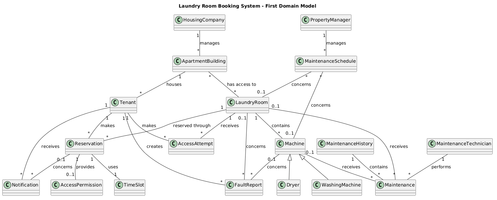

# Task 2 - First Domain Model

For my first domain model I used the conceptual classes that I selected in Task 1.

I started by looking at how the main concepts could be connected to each other.

## Main relationships

A Tenant lives in an Apartment Building.

An Apartment Building has access to one or more Laundry Rooms.

A Laundry Room contains Machines.

A Machine can be a Washing Machine or a Dryer.

A Tenant makes Reservations.

A Reservation is for a Laundry Room and a Time Slot.

A Tenant can create Fault Reports.

A Fault Report concerns a Machine or a Laundry Room.

A Property Manager manages Maintenance Schedules.

A Maintenance Schedule can concern a Laundry Room or a Machine.

A Maintenance Technician performs Maintenance.

Maintenance can be performed on a Machine or a Laundry Room.

A Reservation can give a Tenant an Access Permission for a Laundry Room.

An Access Attempt is made by a Tenant for a Laundry Room.

Notifications can be sent to a Tenant about a Reservation.

## First thoughts about multiplicities

One Tenant can have many Reservations, but each Reservation belongs to one Tenant.

One Laundry Room can have many Reservations over time, but each Reservation is for one Laundry Room.

One Laundry Room can contain several Machines.

One Apartment Building can have access to one or more Laundry Rooms.

One Tenant can create several Fault Reports.

One Machine or Laundry Room can have several Fault Reports over time.

A Machine or Laundry Room can have several Maintenance records over time.

## First domain model

The PlantUML source for the diagram is available in `05-task-2-domain-model.puml`.

This is my first version of the domain model. Some relationships and multiplicities may need to be changed after comparing the model with the requirements again.
